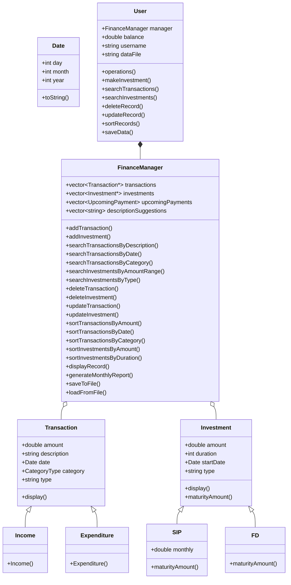
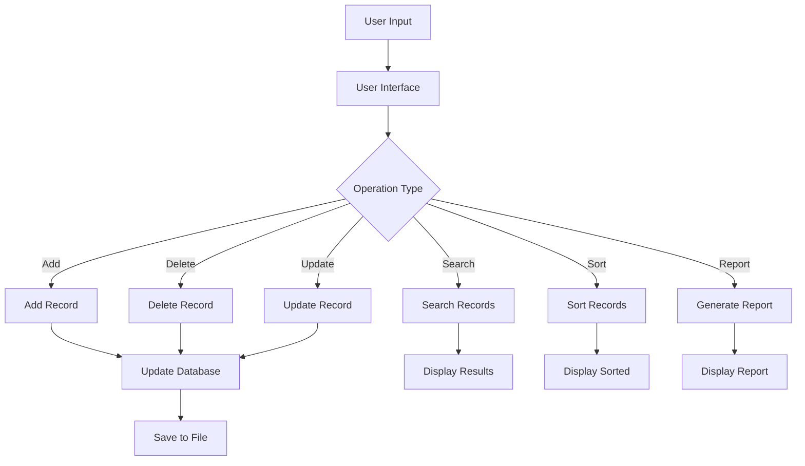

# Personal Finance Management System

A console-based application for managing personal finances, including income, expenditure, and investments tracking, with comprehensive search, sort, and reporting functionalities.

## Project Overview

This system enables users to manage their financial data effectively through a variety of features including:
- Recording income and expenditures
- Making and tracking investments 
- Generating reports
- Searching, updating, and deleting records
- Sorting financial data by various criteria

## Data Structures Used

### 1. Vectors
Vectors are used to store collections of transactions, investments, upcoming payments, and description suggestions. They provide dynamic arrays with automatic resizing, allowing for efficient storage and retrieval of financial records.

```cpp
vector<Transaction*> transactions;
vector<Investment*> investments;
vector<UpcomingPayment> upcomingPayments;
vector<string> descriptionSuggestions;
```

### 2. Simple Structures
The system uses simple structures instead of complex classes to make the code more accessible:

```cpp
struct Date { /* ... */ };
struct Transaction { /* ... */ };
struct Income : Transaction { /* ... */ };
struct Expenditure : Transaction { /* ... */ };
struct Investment { /* ... */ };
struct SIP : Investment { /* ... */ };
struct FD : Investment { /* ... */ };
```

### 3. Enums
Enums are used for categorization to make the code more readable:

```cpp
enum CategoryType {
    INCOME,
    FOOD,
    HOUSING,
    // ...
};
```

## Algorithms Implemented

### 1. Search Algorithms
Linear search is used to find records based on various criteria:
- Search by description (partial string matching)
- Search by date
- Search by category
- Search by amount range

### 2. Sorting Algorithms
The system implements sorting for both transactions and investments:
- Sort by amount (ascending/descending)
- Sort by date (newest/oldest first)
- Sort by category
- Sort by duration (for investments)

The std::sort algorithm is used with custom lambda comparators.

### 3. Data Processing
- Monthly financial report generation
- Investment maturity calculation

### 4. Time Complexity Analysis

| Operation | Algorithm | Time Complexity | Space Complexity |
|-----------|-----------|-----------------|------------------|
| Search by Description | Linear Search | O(n) | O(1) |
| Search by Date | Linear Search | O(n) | O(1) |
| Search by Category | Linear Search | O(n) | O(1) |
| Search by Amount Range | Linear Search | O(n) | O(1) |
| Sort by Amount | std::sort | O(n log n) | O(log n) |
| Sort by Date | std::sort | O(n log n) | O(log n) |
| Sort by Category | std::sort | O(n log n) | O(log n) |
| Insert Transaction | Vector Push Back | O(1) amortized | O(1) |
| Delete Transaction | Vector Erase | O(n) | O(1) |
| Update Transaction | Direct Access | O(1) | O(1) |
| Description Suggestion | Linear Search | O(n) | O(1) |
| Upcoming Payments Sort | std::sort | O(n log n) | O(log n) |

## System Architecture



## Data Flow



## Simplified Design Choices

1. **Structures instead of Classes**: Using simple structures with inheritance for better readability and easier understanding.

2. **Simple Enums**: Using enums for categories instead of class-based enums for cleaner code.

3. **Vector-based Implementation**: Using vectors for all collection needs instead of specialized data structures like maps, tries, and priority queues.

4. **Direct String Comparison**: Simple string operations for description suggestions instead of complex trie data structure.

5. **Manual Sorting**: Using std::sort with custom comparators for upcoming payments instead of priority queue.

## Team Members

- Ananya Addisu - BDU1600957
- Abiyu Zewdu - BDU1600628
- Amanuel Amare - BDU1600905
- Abel Amare - BDU1601012
- Nuhamin Enbakum - BDU1602288
