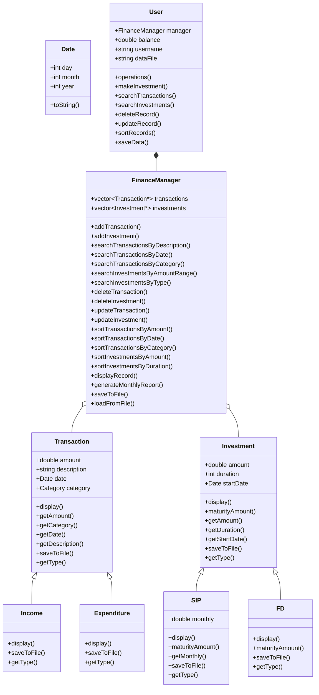
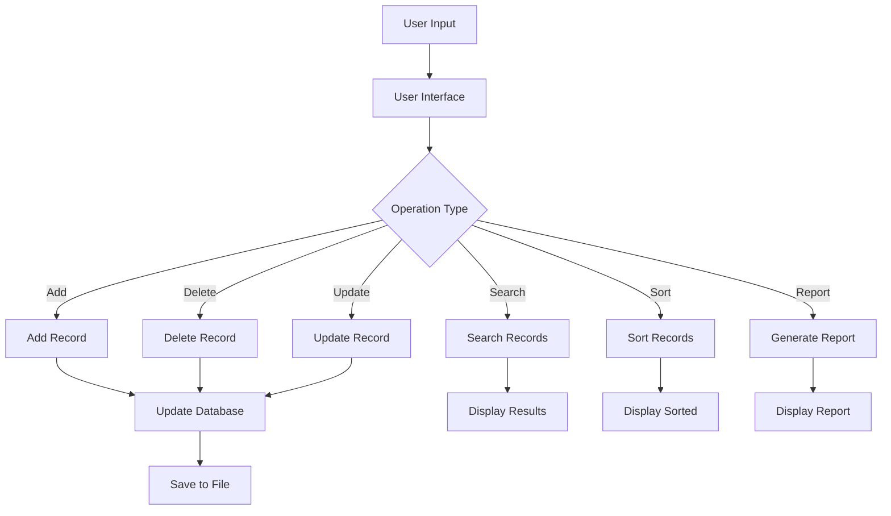

# Personal Finance Management System

A console-based application for managing personal finances, including income, expenditure, and investments tracking, with comprehensive search, sort, and reporting functionalities.

## Project Overview

This system enables users to manage their financial data effectively through a variety of features including:
- Recording income and expenditures
- Making and tracking investments 
- Generating reports
- Searching, updating, and deleting records
- Sorting financial data by various criteria

## Data Structures Used

### 1. Vectors
Vectors are used to store collections of transactions and investments. They provide dynamic arrays with automatic resizing, allowing for efficient storage and retrieval of financial records.

```cpp
vector<Transaction*> transactions;
vector<Investment*> investments;
```

### 2. Priority Queue
A priority queue is implemented to manage upcoming payments, ensuring they are automatically sorted by date.

```cpp
priority_queue<UpcomingPayment, vector<UpcomingPayment>, PaymentCompare> upcomingPayments;
```

### 3. Trie
A trie data structure is used for auto-suggestion of transaction descriptions, providing efficient prefix-based searching.

```cpp
class Trie {
    // Implementation details
};
```

### 4. Maps and Unordered Maps
Maps and unordered maps are used for efficient key-value lookups in the transaction indexing system and the trie implementation.

```cpp
unordered_map<string, Transaction*> transactionMap;
unordered_map<char, unique_ptr<TrieNode>> children;
```

### 5. Object-Oriented Design
The system uses inheritance to create specialized types of transactions and investments:
- Transaction (base class)
  - Income (derived class)
  - Expenditure (derived class)
- Investment (base class)
  - SIP (derived class)
  - FD (derived class)

## Algorithms Implemented

### 1. Search Algorithms
Linear search is used to find records based on various criteria:
- Search by description (partial string matching)
- Search by date
- Search by category
- Search by amount range

### 2. Sorting Algorithms
The system implements sorting for both transactions and investments:
- Sort by amount (ascending/descending)
- Sort by date (newest/oldest first)
- Sort by category
- Sort by duration (for investments)

The std::sort algorithm is used with custom comparators.

### 3. Data Processing
- Monthly financial report generation
- Investment maturity calculation

### 4. Time Complexity Analysis

| Operation | Algorithm | Time Complexity | Space Complexity |
|-----------|-----------|-----------------|------------------|
| Search by Description | Linear Search | O(n) | O(1) |
| Search by Date | Linear Search | O(n) | O(1) |
| Search by Category | Linear Search | O(n) | O(1) |
| Search by Amount Range | Linear Search | O(n) | O(1) |
| Sort by Amount | std::sort (Introsort) | O(n log n) | O(log n) |
| Sort by Date | std::sort (Introsort) | O(n log n) | O(log n) |
| Sort by Category | std::sort (Introsort) | O(n log n) | O(log n) |
| Insert Transaction | Vector Push Back | O(1) amortized | O(1) |
| Delete Transaction | Vector Erase | O(n) | O(1) |
| Update Transaction | Direct Access | O(1) | O(1) |
| Trie Insert | Character-by-Character | O(m) where m is string length | O(m) |
| Trie Search | Character-by-Character | O(m) where m is string length | O(1) |
| Priority Queue Insert | Heap Operation | O(log n) | O(1) |
| Priority Queue Extract Min | Heap Operation | O(log n) | O(1) |

## System Architecture



## Data Flow



## Requirements Analysis

```mermaid
flowchart TD
    root((Finance Management))
    
    core[Core Features]
    data[Data Management]
    ux[User Experience]
    
    root --> core
    root --> data
    root --> ux
    
    add[Add Records]
    search[Search Records]
    delete[Delete Records]
    update[Update Records]
    sort[Sort Records]
    reports[Reports]
    
    core --> add
    core --> search
    core --> delete
    core --> update
    core --> sort
    core --> reports
    
    add --> income[Income]
    add --> expenditure[Expenditure]
    add --> investment[Investment]
    
    search --> byDesc[By Description]
    search --> byDate[By Date]
    search --> byCat[By Category]
    search --> byAmount[By Amount]
    
    delete --> delTrans[Transactions]
    delete --> delInv[Investments]
    
    update --> modDetails[Modify Details]
    
    sort --> sortAmount[By Amount]
    sort --> sortDate[By Date]
    sort --> sortCat[By Category]
    sort --> sortDur[By Duration]
    
    reports --> monthly[Monthly Report]
    
    fileio[File I/O]
    ds[Data Structures]
    
    data --> fileio
    data --> ds
    
    fileio --> saveData[Save Data]
    fileio --> loadData[Load Data]
    
    ds --> vector[Vector]
    ds --> pq[Priority Queue]
    ds --> trie[Trie]
    ds --> maps[Maps]
    
    ux --> console[Console Interface]
    ux --> payments[Upcoming Payments]
    ux --> suggest[Auto-suggest]
```



## How to Run

1. Compile the code using a C++ compiler:
   ```
   g++ main.cpp -o finance_manager
   ```

2. Run the executable:
   ```
   ./finance_manager
   ```

3. Follow the on-screen menu to use the system features.

## Team Members

- Ananya Addisu - BDU1600957
- Abiyu Zewdu - BDU1600628
- Amanuel Amare - BDU1600905
- Abel Amare - BDU1601012
- Nuhamin Enbakum - BDU1602288 